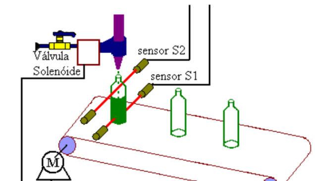

## Exercício de Sistemas Microcontrolados (E8)

O objetivo era fazer uma "Envasadora de cerveja automática" em C e assembly, utilizando a STM32F103C8T6 (BluePill) com ARM Cortex M3.

A imagem abaixo ilustra como seria o funcionamento do projeto.

As garrfas se movimentariam através de uma esteira controlada pelo microcontrolador. O Sensor 1 é ativado quando uma garrafa chega e o injetor é acionado. O Sensor 2 detecta quando a garrafa enche até o nível desejado. Após 2 segundos, o injetor para o a esteira (motor)
é acionado até que o sensor 1 seja ativado novamente.

Para fins didáticos, o motor e o injetor são tratados como LEDs verde e vermelho, respectivamente. As saídas dreno aberto são ideais para tensões de acionamento maiores as que o microcontrolador é capaz de suportar.
O código `E8_assembly.c` apenas executa o código assembly `E8.s`, requisitado pelo enunciado. As versões em assembly e C executam a tarefa da mesma forma.

O trabalho foi feito em grupo, com mais 2 alunos Gabriel e Johanna.
